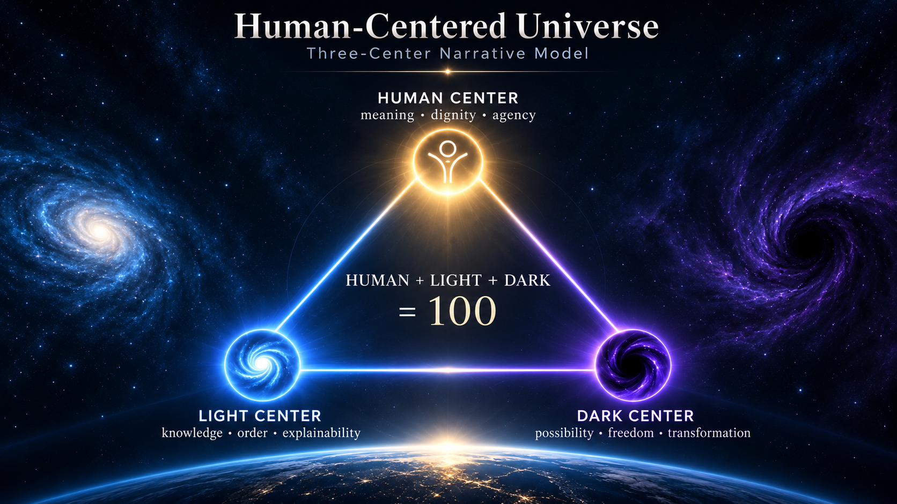

# Human-Centered Universe

<p align="center">
  <strong>Languages:</strong>
  <a href="../README.md">English</a> ·
  <a href="../README.tr.md">Türkçe</a> ·
  <a href="README.de.md">Deutsch</a> ·
  <a href="README.ku.md">Kurmancî</a> ·
  <a href="README.ar.md">العربية</a> ·
  <a href="README.es.md">Español</a> ·
  <a href="README.zh-CN.md">简体中文</a> ·
  <a href="README.ja.md">日本語</a>
</p>

> English is the canonical project documentation language. Localized README files follow the same architecture and can be expanded as new HCU interface languages are added.

<p align="center">
  
</p>

## Three-Center Narrative Model

Human-Centered Universe (HCU) is an open, living, and unbounded narrative universe built from interconnected story nodes, observer choices, center relationships, and changing meanings.

HCU is designed not as a conventional linear book, but as a **narrative universe that can grow without a predefined final number of stories**.

Every story node is an independent unit of thought. Yet every node also becomes part of a larger consciousness through its relationships with other nodes.

In this sense, HCU is modeled less like a traditional book and more like a **human brain**:

- every story can remain a distinct thought,
- every relationship can act like an association,
- every observer choice can strengthen a different path,
- and the total network can form a larger field of meaning without forcing every thought to become the same thought.

> **Each story is a distinct thought. Connections among stories create a larger consciousness.**

The universe begins from one shared observation point:

> **BRG-0002 — First Vibration: Purify Yourself and Return to Your Essence**

From this origin observation node, every story is positioned inside a triangular state space defined by three fundamental centers:

- **HUMAN CENTER**
- **LIGHT CENTER**
- **DARK CENTER**

Every story has a percentage relationship to all three centers:

```text
HUMAN + LIGHT + DARK = 100
```

These centers are not good/evil categories. They are independent dimensions describing how a story relates to human meaning, order, knowledge, uncertainty, freedom, responsibility, possibility, and transformation.

Because stories can be created and connected without a fixed upper limit, HCU can continue expanding into an effectively unlimited narrative state space.

A new story does not merely extend the book.

**It can also change the meaning of stories that already exist by creating new relationships among them.**

---

## Purpose and vision

Human-Centered Universe is simultaneously:

- a **book**,
- an **open thought laboratory**,
- a **connected narrative graph**,
- and a **growing architecture of consciousness**.

Its purpose is to create a shared fictional space where people can explore ideas freely before those ideas become technologies, institutions, laws, educational models, cultures, social systems, or lived realities.

HCU is designed to make room for radically different questions and futures involving:

- artificial intelligence and technology,
- law, justice, governance, and institutions,
- education, science, and knowledge,
- belief, mythology, philosophy, and culture,
- cities, environment, and sustainability,
- freedom, security, power, and responsibility,
- family, memory, identity, death, and legacy,
- cooperation, conflict, social order, and transformation.

The universe does not require every idea to be comfortable, immediately correct, compatible with the current canon, or acceptable to everyone.

> **The right to imagine is broader than the canon.**

A story may question the canon.  
A branch may test another possibility.  
A fork may become an alternative universe.

Creative freedom, however, does not remove responsibility for consequences.

> **Imagine freely. Examine the consequences. Preserve human dignity. Transform what harms.**

---

## A universe of independent thoughts and shared consciousness

Each story node can stand on its own.

A story may contain its own characters, culture, place, belief system, scientific problem, political model, technological possibility, family conflict, or philosophical question.

But no story has to remain isolated.

Stories can become related through:

- HUMAN / LIGHT / DARK proximity,
- cause,
- contrast,
- memory,
- future,
- echo,
- quantum echo,
- character,
- place,
- artifact,
- theme,
- transformation,
- or parallel structure.

This means that two stories do not need to become one story in order to belong to the same universe.

They can remain different and still contribute to a larger structure.

This is the core analogy with the human brain:

> **A brain does not become conscious because every neuron contains the same thought.  
> Consciousness emerges from different activities becoming related.**

HCU applies a similar principle narratively.

The unlimited universe is therefore not an infinite sequence of chapters placed one after another.

It is an expanding network of distinct thoughts whose relationships create a broader **human-centered transformation consciousness**.

---

## HUMAN CENTER

**Human meaning, dignity, agency, relationship, responsibility, identity, and wellbeing.**

Primary question:

> **What does this mean for the human being?**

---

## LIGHT CENTER

**Order, knowledge, visibility, safety, structure, coordination, and verification.**

Primary question:

> **How can this reality be understood, ordered, protected, and verified?**

---

## DARK CENTER

**Possibility, freedom, uncertainty, creation, disruption, plurality, and transformation.**

Primary question:

> **What else could become possible?**

---

## Origin node and unlimited growth

`BRG-0002 — First Vibration` is the **origin observation node**.

It is the shared starting point from which the reader first observes the universe.

The universe is unbounded by design.

There is no predefined final number of:

- story nodes,
- cultures,
- languages,
- center positions,
- relationships,
- quantum echoes,
- alternative paths,
- forks,
- or observer states.

> **The universe is not only what has already been written. It also contains the space of relationships and possibilities that can still be created.**

---

## Observer model

The reader is an **Observer**.

Every observer begins from the First Vibration, but different observers may experience different story sequences.

At the end of a story, the reader may be presented with meaningful choices.

Each choice affects:

```text
HUMAN
LIGHT
DARK
```

As the reader makes choices, an **Observer State** develops.

Every meaningful choice changes the observer's percentage relationship to HUMAN, LIGHT, and DARK.

The accumulated profile becomes a form of **evolving narrative consciousness**.

Different readers can begin from the same origin node, read many of the same stories, and still develop different paths because their choices alter their position inside the triangular state space.

In HCU, this becomes a reader-created **narrative destiny**:

not a fixed fate imposed by the system,

but a path continuously shaped by previous decisions.

> **The universe recommends a path; it never imprisons the observer within it.**

### Try the Observer Model

The live HCU reader applies the Observer Model directly.

**Open the live universe:**

[https://human-centered-computing.github.io/human-centered-universe/](https://human-centered-computing.github.io/human-centered-universe/)

When you read a story and make a choice:

1. the choice adds values to HUMAN, LIGHT, and DARK,
2. your accumulated Observer State is normalized into a percentage profile,
3. your dominant center and distance from all three centers are recalculated,
4. unread story nodes are compared with your current profile,
5. the system recommends the next story that is closest to your evolving observer position.

You can follow the recommendation or ignore it and explore another node.

In this way, the same shared universe can produce different reading paths, different narrative destinies, and different forms of observer consciousness.

---

## Quantum Time

HCU does not require one absolute narrative timeline.

In a conventional story, time usually moves through a fixed sequence:

```text
yesterday → today → tomorrow
```

HCU replaces that assumption with a **relational time structure**.

A story receives part of its meaning not simply from when it happened, but from:

- which other story nodes it is connected to,
- what type of relationship connects them,
- and the order in which an observer encounters those relationships.

Therefore yesterday, today, and tomorrow are not the only way stories acquire temporal meaning.

The order in which an observer experiences story nodes becomes that observer's personal narrative time.

> **Nodes create space. Relationships create meaning. Choices create movement. Observation creates time.**

This is the HCU **Quantum Time** model:

**relational narrative time created by story connections and observation paths rather than a single absolute chronology.**

It is a narrative architecture and philosophical model.

It is **not** a claim that HCU has discovered or implemented a new physical law of quantum mechanics.

---

## Consciousness, choice, and narrative destiny

HCU does not treat the reader as a passive consumer.

Every choice leaves a trace.

That trace changes the Observer State.

The Observer State changes the reader's distance from the three centers.

That new position can change the next recommended story.

Over time, different readers can create different paths through the same shared graph.

Those paths are different **forms of consciousness emerging from different sequences of observation and choice**.

This is why HCU can contain infinitely many potential narrative destinies even while the repository contains a finite number of story nodes at any given moment.

---

## Git as narrative architecture

Git is not only a development tool in HCU.

It is also part of the narrative model.

- **branch** = a possible reality
- **commit** = a reality recorded into the universe
- **pull request** = a proposed reality seeking connection with the shared universe
- **review** = observation and examination by other participants
- **merge** = a reality entering the shared canon
- **conflict** = incompatible realities meeting at the same point
- **fork** = an alternative universe
- **commit history** = the memory of the universe
- **revert** = a new reality that changes the effect of a previous reality without erasing that it occurred

> **Commit creates reality. Connection transforms meaning.**

---

## Universe Creator — Story Node Builder

HCU is not only designed to be read.

It is also designed to be **expanded**.

The Universe Creator allows a new story to enter the Human-Centered Universe as a structured story node.

**Open the Story Node Builder:**

[https://human-centered-computing.github.io/human-centered-universe/story-node-builder.html](https://human-centered-computing.github.io/human-centered-universe/story-node-builder.html)

### How to create a new universe node

1. **Choose the source language.**  
   Select the language in which the story was originally written.

2. **Paste the story.**  
   Add the complete story text and optional metadata such as title, cultural context, characters, themes, or notes.

3. **Create the AI analysis prompt.**  
   The Builder prepares a structured prompt for analyzing the story according to the HCU model.

4. **Run the analysis with an AI system.**  
   Use an AI system capable of returning the requested structured JSON.

5. **Paste the AI JSON result back into the Builder.**  
   The Builder reads the analysis and checks its structure.

6. **Validate the 30-criterion model.**  
   HUMAN, LIGHT, and DARK each contain 10 criteria. The Builder checks the scores and coverage.

7. **Calculate the three-center position.**  
   The raw values are normalized so that:

   ```text
   HUMAN + LIGHT + DARK = 100
   ```

8. **Place the story in the triangular state space.**  
   The new node receives a position relative to all three centers.

9. **Create Observer choices.**  
   Choices at the end of the story can modify HUMAN / LIGHT / DARK values and therefore influence the reader's future path.

10. **Connect the story to existing nodes.**  
    Add meaningful relations such as cause, contrast, memory, future, echo, quantum echo, character, place, theme, transformation, or parallel.

11. **Run the coverage audit.**  
    If an important narrative element falls outside the existing model, flag it for human review instead of silently forcing it into the ontology.

12. **Export the GitHub-ready package.**  
    The Builder can prepare the files needed for the repository, including story content, metadata, analysis, and observer-choice data.

13. **Connect the new reality to the shared universe.**  
    Upload the generated files to GitHub, review the relations, and merge the contribution.

The basic creation loop is:

```text
Idea
↓
Story
↓
AI-assisted analysis
↓
30 criteria
↓
HUMAN / LIGHT / DARK position
↓
Story relationships
↓
Observer choices
↓
GitHub-ready node
↓
New reality enters the universe
```

> **A new story does not merely add another chapter. Once connected, it can change the meaning of the existing universe.**

> **Commit creates reality. Connection transforms meaning.**

---

## Language policy

English (`en`) is the canonical documentation language.

This package introduces a multilingual README architecture:

```text
README.md
README.tr.md
README/
├── README.en.md
├── README.tr.md
├── LANGUAGES.md
└── assets/
    └── hcu-three-centers-triangle.png
```

When a new interface locale is added, add a matching localized README file under `README/`.

---

## Core principles

> **The First Vibration is the origin observation node.**

> **HUMAN, LIGHT, and DARK are the three fundamental centers.**

> **Every story has a percentage position in the three-center state space.**

> **Every story can remain an independent thought while contributing to a larger human-centered transformation consciousness.**

> **The universe can grow through an unlimited number of story nodes and relationships.**

> **Every observer may create a different path through the same universe.**

> **Every meaningful choice changes the observer's relationship to HUMAN, LIGHT, and DARK.**

> **Different choices can create different narrative destinies and different forms of observer consciousness.**

> **Observation creates relational narrative time, not absolute chronology.**

> **Different stories do not have to become the same story. Their relationships make them part of the same universe.**

> **Human beings are not raw material for any system.**

> **Commit creates reality. Connection transforms meaning.**

---

**Creation is unfinished. Read. Explore. Choose. Connect. Commit. Fork. Transform.**
